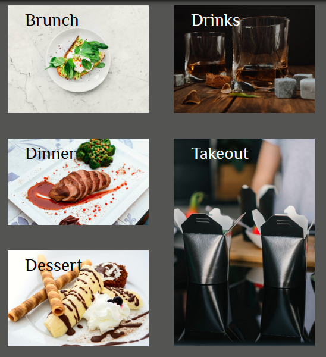

# Restaurant Landing Page

This project is the landing page for a fake restaurant called _Mehr_ . It is responsively designed for mobile, tablet and desktop environments. It is able to perform basic functions of dynamic webpages through DOM manipulation and allows for user interactivity with a nav bar, modals and forms.

## About this project

### Why do it?

After learning the fundamentals of CSS and some Javascript, I wanted to make a project that encompassed more complex elements compared to previous projects I've done like my [Crypto Calculator](https://paul-mcj.github.io/Crypto-Calculator/) or my [Music Player](https://paul-mcj.github.io/Music-Player/). This is by far my biggest project to date, and has taken me dozens of hours to complete with almost 2000 lines of code total.

Like these other projects, this one does not use any frameworks, external libraries or packages -- it is **purely** HTML, CSS and vanilla Javascript.

### Challenges and what I learned

-    Regarding CSS, this project taught me the importance of containerization and the importance of layering child elements inside of parent nodes. There were many times at the beginning of this project when building the foundation where I was having difficulties with setting text and images in a coherent manner. After researching and playing around with the structure of the HTML code, I finally got a handle on why elements are layered in a "containerized" way.

-    I also became much more comfortable with grid-template-areas, and grid in general. Being able to set child elements directly to a grid-item actually became so much fun, that I decided to change the grid layout for my largest media query, which I think turned out well changing the grid from a singular list to more of a side-by-side layout:

     

     

-    I took some time to focus on accessability concerns as well. Regarding CSS, most of that time was spent making sure that contrast met standards. I also wanted to make sure that I could hide `<label>` elements to give them custom styling, but still remain available for users who navigate the page with the tab key. This is the utility class I used for such elements:

```css
/* Utility class for several pseudo elements to hide them on the page but make sure content is there for accessability reasons. */
.sr-only {
     position: absolute;
     width: 1px;
     height: 1px;
     padding: 0;
     margin: -1px;
     overflow: hidden;
     clip: rect(0, 0, 0, 0);
     white-space: nowrap;
     border: 0;
}
```

-    I also learnt how to stack images in multiple layers so that an opacity gradient can be placed over the images, yet not the text the resides on them. This opacity-on-image and clear text is seen at the slideshow at the top of the page:


-    I learnt how to incorporate modals into a document as well. This forced me to really use my knowledge of positioning to make sure they appeared in the correct places, as well as make sure I used event delegation in Javascript to fill in modal form elements and submit data correctly. This project has a few small modals to relay user input information to the screen, but also has a larger one with a form:


-    I also got to use embedded elements in the HTML of this project. Through some Googling, it was easy enough to put the `<iframe>` in the _index.html_ file, though I had to introduce some Javascript arithmetic to make sure it was centered in its container, as well as make sure the initial size is correct when the DOM is finished loading, and if the screen size changes (ie. with _DOMContentLoaded_ and _resize_ event listeners).

```js
// The map needs to have a dynamic sizing depending on the size of screen the user has.
function calcMapSize() {
     iFrameWidth = window.innerWidth;
     mapPadding = window
          .getComputedStyle(bottomSectionMap)
          .getPropertyValue(`padding-left`); // in order to center the iframe, get the padding from its parent container...
     iFrameWidth -= parseInt(mapPadding) * 2; //... and subtract both left and right from it
     iFrame.setAttribute("height", iFrameWidth);
     iFrame.setAttribute("width", iFrameWidth);
}
```

-    One very interesting thing I did was create multiple copies of each image, so that when the screen size changed with media queries, the image source would change, too. This meant that each image has a mobile version, tablet version, and desktop version, with the smaller viewports taking low resolution pictures over larger ones that could source better quality images. I did this because when I tested the project on mobile, I found the loading times way to slow and it was mainly due to not minimizing resolution for images when high-definition isn't necessary.
-    By doing this, my loading times increased drastically--most of my image transfer sizes upon page initialization went down over 95%! For example, the desktop size of the _wine.jpg_ image is 3.94MB, yet the mobile source _wine-mobile.jpg_ is only 60.5KB!

-    I also had a **major** issue towards the end of the project, where I was trying to figure out why all-of-a-sudden all the interactive elements of the my page stopped working. It took me a few days to realize it was such a small mistake: I had placed an `event.preventDefault()` statement in the wrong place inside of my function that submitted the data from my private dining modal! Needless to say, I _hopefully_ won't make this mistake again!

## Conclusions

This app was a lot of work. It took me a long time to complete, and I had to scrap/re-do a lot of singular elements and functions through building it for optimization.

One major change I would like to do with my next project is to break apart my code in modules -- this project only has one file each for HTML, CSS and Javascript which I feel could be difficult to read.

I would also like to use a front-end framework for my next project, as I feel using vanilla Javascript for all my projects is becoming not only taxing, but isn't showing more of my skill-set.

## Author

-    LinkedIn: [Paul McJannet](https://www.linkedin.com/in/paul-mcjannet)
-    Github: [paul-mcj](https://github.com/paul-mcj)
